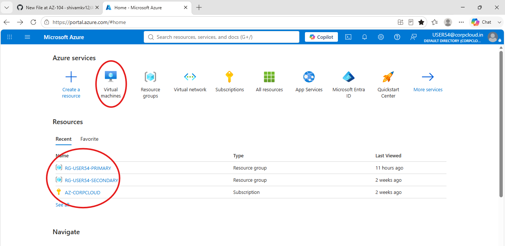
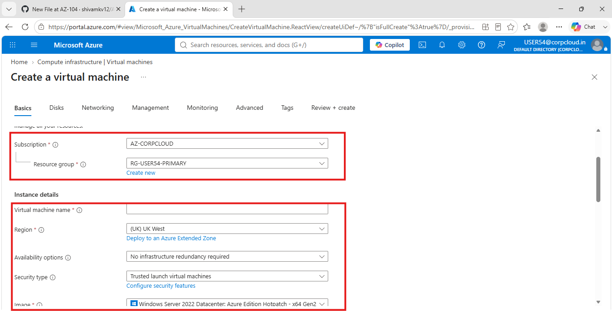
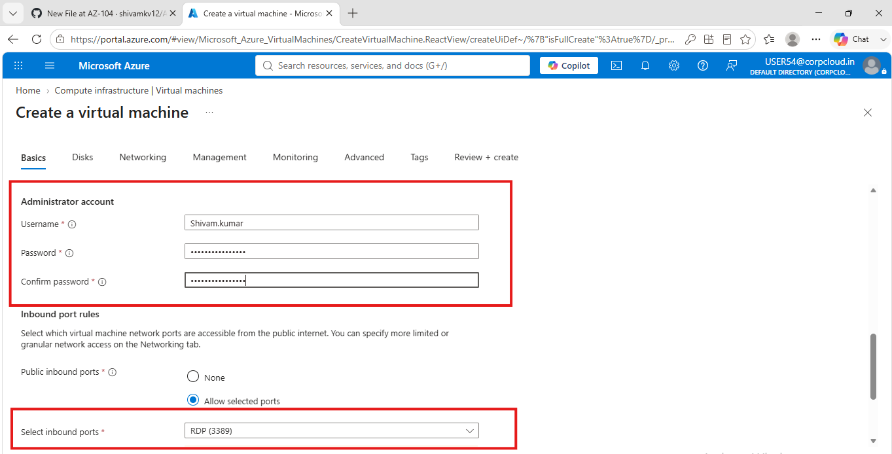
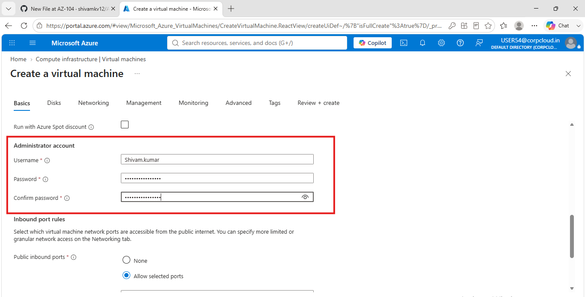
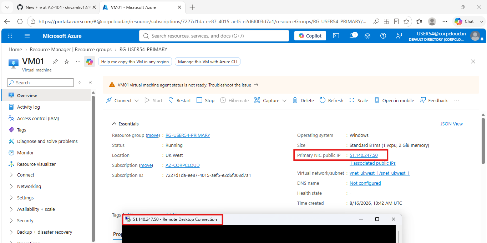

Lab 01: Azure Virtual Machine

Objective

The objective of this lab was to create and deploy a basic Windows Virtual Machine in Microsoft Azure using the Azure Portal.
This lab focuses on understanding the basic process of creating and accessing an Azure Virtual Machine.

Azure Services Used

- Azure Virtual Machine
- Azure Resource Group
- Azure Virtual Network
- Public IP Address
- Network Interface

Lab Steps

1. Resource Group and Subscription

- Selected the Azure subscription.
- Selected the resource group where the VM would be created.
- A resource group is a logical container used to organize and manage Azure resources.

---

2. Virtual Machine Configuration

- Selected the resource group.
- Entered the virtual machine name.
- Selected the Azure region.
- Selected the Windows operating system image.
- Selected the required VM size.

---

3. Administrator Account and RDP

- Created an administrator account for the Windows VM.
- Configured the username and password.
- Allowed Remote Desktop Protocol (RDP) access.
- RDP uses TCP port 3389 by default.

---

4. Administrator Account

- Configured the administrator username and password.
- The administrator account is used to log in to and manage the Windows VM.
- The password was kept private and was not uploaded to GitHub.

---

5. VM Deployment

- Reviewed the VM configuration.
- Started the deployment.
- Azure created the required resources.
- The virtual machine was successfully deployed.

---

Basic Concepts

Resource Group

- A logical container for Azure resources.
- Helps organize and manage related resources.
- The VM and its associated resources can be managed through the resource group.

Region

- The geographical location where the Azure VM is deployed.
- The selected region determines where the VM's resources are physically hosted.
- Choosing a region closer to users can help reduce network latency.

Administrator Account

- Used to log in to and manage the Windows VM.
- Requires a username and strong password.
- Credentials should always be kept private.

RDP

- RDP stands for Remote Desktop Protocol.
- It allows remote access to a Windows VM.
- Windows Remote Desktop can be used to connect to the VM.
- The default RDP port is TCP 3389.

Public IP Address

- Allows the VM to communicate with the internet.
- A public IP can be used to connect to the VM remotely.
- In this lab, the public IP was used for RDP connectivity.

RDP Port

- TCP 3389 is the default port used by RDP.
- An inbound rule must allow this traffic for direct RDP connectivity.
- RDP access should be restricted in production environments.

---

Result

The Windows Virtual Machine was successfully created and deployed in Microsoft Azure.

Key Learnings

- Created an Azure Virtual Machine.
- Selected a resource group and Azure region.
- Configured a Windows operating system.
- Created an administrator account.
- Enabled RDP access.
- Understood the purpose of a public IP address.
- Understood the basic VM deployment process.

Conclusion

This lab provided hands-on experience with creating and deploying a basic Windows Virtual Machine in Microsoft Azure. It helped me understand the fundamental components and configuration required to deploy and remotely access an Azure VM.

